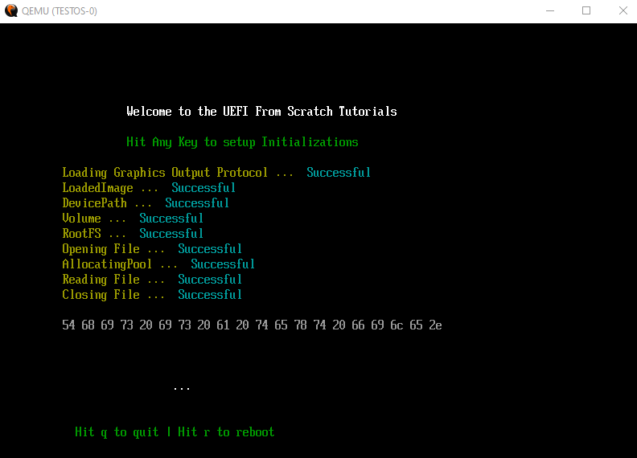
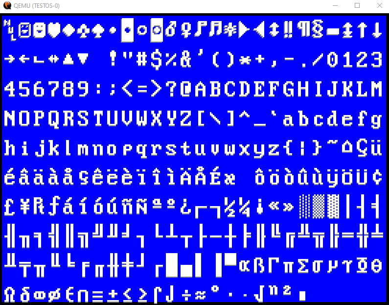
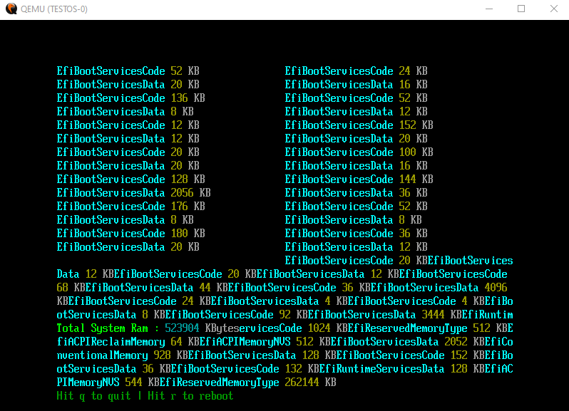
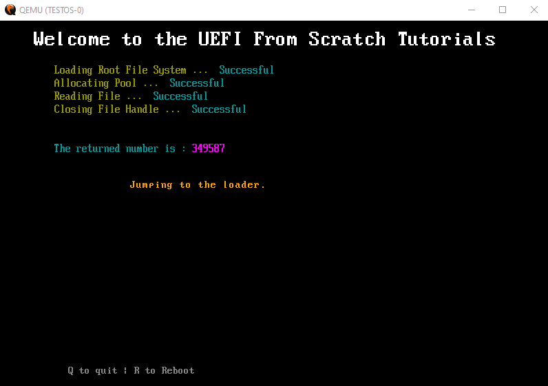
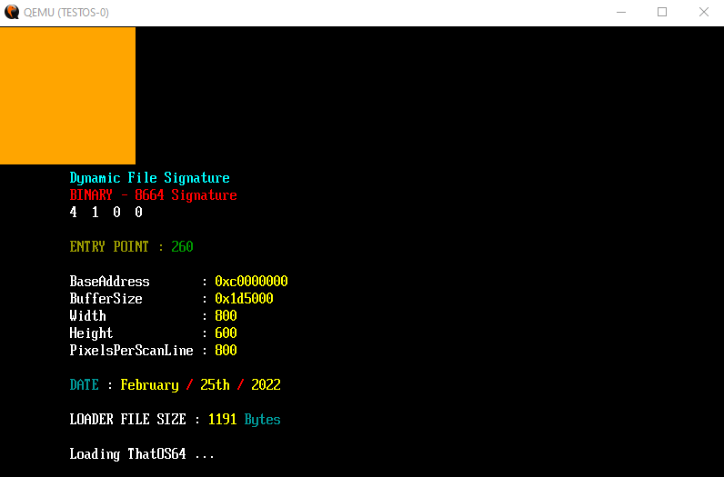

# EFI for OS Development from scratch

# MESSAGE TO ALL  
Originally from my C Based EFI Tutorial series from scratch youtube channel.  

I discovered that a complete rip-off of my former youtube channel has been re-uploaded to youtube, banner graphics and all. They even posted a link to my original github repo, but it didn't exist. So for the persons who subbed to that guy's channel, I am uploading this for them. I feel for those who were trying to learn from those videos, but had no code to learn from. However, the code is not guaranteed to be the same.  

This source code is archived.  
 
My new favorite quote "Don't push someone to the point that they don't care !"  

So long, and thanks for the fish.  

-- ThatOSDev  

# NOTES  
- All code has been tested as working against GCC 11.2.0. 
- I am now officially done with the OSDev world. This is here for anyone at their own risk.  
- There are two tuts on how to use the GDT. Just showing that there is more then one way to "skin the cat".   
- WARNING - This code is for teaching purposes only. It is not written for professional use. Some code is written in order to speed up teaching, and thus is not properly coded. You should rewrite the code for your own professional use.  
- For video 33 ( which is Code 29 on Github ), I am using [FASM](https://flatassembler.net/). However, that code in that video is not guaranteed to be the same.   
- Open source Tool to create an EFI based GPT Partitioned virtual HDD file. Big THANK YOU to [Hamid Nazari](https://github.com/hamidnazari/ThatDiskCreator) for his hard work on creating this tool. The source code should work on all platforms and will make OS Development that much easier.  
- You might have noticed in my re-uploaded code that I am using includes from the C standard. There is nothing wrong with that. So I am sharing that it does work in this re-uploaded code. The videos just show that you can do it without the standard C library headers.  

- THE TUTORIALS ON YOUTUBE ARE WINDOWS BASED, BUT CODE SHOULD WORK IN LINUX AND MAC. 

- **UEFI 2.9 Specs PDF** : https://uefi.org/specifications  

- **NOTICE** : The 40 meg file is still there, and can now be used by MAC and Linux users. The 256 meg file is in the ZIP inside of the HOLD folder for those who want a larger drive.hdd file to play with. All Operating System users CAN use that size file too.  

- **The original HDD IMAGECREATOR software has been removed. It has been replaced with the new tool coded by Hamid Nazari.**  

# BUILD INSTRCUTIONS  
**Linux, Mac, Windows**  
[https://github.com/ThatOSDev/C_UEFI/blob/master/BUILD.md)  

# READ THIS !!!
- THINGS YOU SHOULD KNOW BEFORE STARTING OS DEVELOPMENT  
    - The C Language  
    - Assembly Language  
    - How to read Hex Code ( Example : 0x8664 )  
    - How your Host Operating System works ( Such as windows or linux )  
    - How your compiler works ( Such as GCC )  
    - How to do research ( Don't be lazy )  
- **BEGINNER MISTAKES** : [https://wiki.osdev.org/Beginner_Mistakes](https://wiki.osdev.org/Beginner_Mistakes)  

  
  
  
  
  
  
 
 
 
